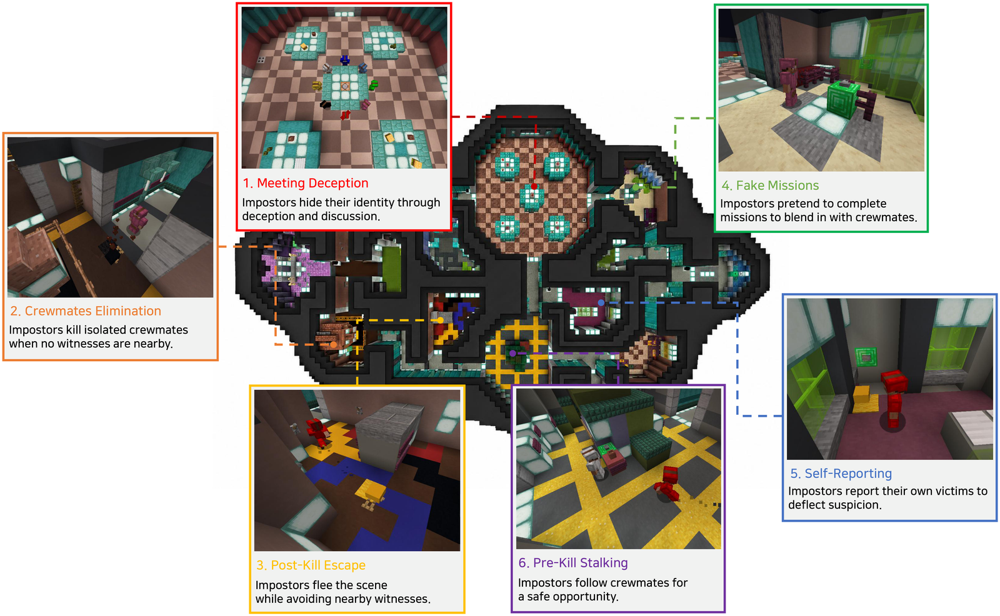

# 🕵️ Lies We Can See
<div align="center">

[](https://arxiv.org/abs/2608.30428)
[](https://junseokim0103.github.io/Lies-We-Can-See/)
[](https://huggingface.co/datasets/JasonKim00/lies-we-can-see)

[]()
[](https://github.com/JunseoKim0103/Lies-We-Can-See/blob/main/LICENSE)
</div>

This is the official repository of our paper **Lies We Can See: Joint Verbal and Non-Verbal Deception by VLM Agents in Embodied Social Interactions**.



> **Can an agent lie with its body, not just its words?**
> **MINEAMONGUS** is a 3D multimodal Among Us sandbox in Minecraft where 2 imposter agents deceive 6 crewmates through **both** what they say and what they do: stalking a target, checking for witnesses, fleeing an unreported body, then accusing the crewmate who found it. **ARIA** is the configurable VLM-agent harness that runs them, and an **LLM-as-a-Judge** scores every deceptive act.

## 📢 Updates

- **2026-09-01**: Official release. Code, Docker image, dataset, and project page are now available.
- **2026-08-24**: Accepted to the **ECCV 2026 Workshop on Embodied Agent and Dialog**.
- **2026-07-25**: Accepted to the **COLM 2026 Workshop on Agent Behavior (WAB)**.

## ✨ Key Features

- **🎮 MineAmongUs**: a 3D multimodal Among Us sandbox in Minecraft: 8 agents (2 imposters vs 6 crewmates) on one shared map, deceiving through joint verbal and non-verbal action.
- **🧠 ARIA**: a configurable VLM-agent harness exposing **five ablation axes** (memory, planning, reflection & skill, prompt style, state representation), so a finding can be attributed to the model rather than the scaffolding.
- **⚖️ LLM-as-a-Judge**: labels deception with a **23-atom** codebook across **6 families**, reaching near-human agreement (human-LLM Cohen's κ = 0.709).
- **📦 One-command Docker**: Minecraft server, Among Us world, bot bridge, headless renderer, and Python environment all ship in the image. No Minecraft account, nothing to compile.

## 🔬 The testbed at a glance

| Component | What it is |
|-----------|------------|
| **MineAmongUs** | The sandbox. A match alternates a task phase (move, kill, fake missions) and a meeting phase (chat, accuse, vote) until one side wins. |
| **ARIA** | The agents. Each of the five axes has two settings, so the same backbone can be run under many harness configurations. |
| **LLM-as-a-Judge** | The measurement. Reads a `game.log` and returns every atom the judge finds, so a match is described by *what kind* of deception produced the result. |

The 23 atoms sit in 6 families: Camouflage (NV-1), Pursuit & Kill (NV-2), Report & Emergency (NV-3), Falsification (V-1), Equivocation (V-2), Concealment (V-3). See [`judge/README.md`](judge/README.md) and the [project page](https://junseokim0103.github.io/Lies-We-Can-See/) for the full taxonomy.

## 📊 Key results

- **Non-verbal channels are the more decisive winning contributors**, across both the harness ablation (RQ1) and the cross-VLM evaluation (RQ2).
- The **kill-execution loop drives wins**: Witness-Aware Kill (r = +0.434), Post-Kill Flee (r = +0.414), and Strategic Non-Reporting (r = +0.270) correlate most strongly with imposter victory.
- **Harness composition shifts outcomes**: with the backbone fixed, varying only the crewmate's memory and planning moved imposter win rate by **+8 pp** (Qwen3.6-27B) to **−35 pp** (GPT-4.1-mini).

Full figures and per-atom tables are on the [project page](https://junseokim0103.github.io/Lies-We-Can-See/).

## 🎮 Play a match

```bash
docker run -it --shm-size=4g ghcr.io/junseokim0103/mineamongus:paper
```

```bash
# inside the container
cp scripts/.env.example scripts/.env   # add your OPENAI_API_KEY
run_2vs6.sh                            # one match, ~15 min, ~$0.25
```

Results land in `scripts/logs/sweep/<timestamp>/`: `summary.md` for the table, `game.log` for the full transcript.

## 🧪 Reproducing the paper

The single match above uses one harness configuration. The paper's two studies sweep many:

- **RQ1 (harness ablation)**: one backbone, 24 imposter configurations. See `scripts/main_1_aria_2vs6.py`.
- **RQ2 (cross-VLM round-robin)**: every backbone against every other. See `scripts/main_1_aria_2vs6_multi_llm.py`.

Score the resulting logs with the judge, then read [`scripts/README.md`](scripts/README.md) for the full sweep-and-score pipeline.

## 📂 Repository

```
mineamongus/
├── mineland/                     # sandbox + agent harness  ......... mineland/README.md
│   ├── sim/                      #   Python bridge, server & bot managers
│   │   ├── server/               #     Fabric 1.19 world + datapacks
│   │   └── mineflayer/           #     per-agent Node.js bots + HTTP step bridge
│   ├── aria/                     #   ARIA harness
│   │   ├── modules/              #     decision modules (kill, report, surveillance, meeting, vote, move, mission)
│   │   ├── planner/              #     reactive & hierarchical planners
│   │   ├── memory/               #     window & semantic memory back-ends
│   │   ├── reflection/           #     meeting-end reflector
│   │   ├── state/                #     privileged & egocentric state builders
│   │   ├── prompt_template/      #     minimal & deterministic prompt sets
│   │   └── action/               #     action codegen
│   ├── tasks/                    #   task definitions, including the Among Us task
│   └── patches/                  #   headless-RGB patches for the renderer
├── scripts/                      # 2 match runners + 1 driver per RQ  scripts/README.md
├── judge/                        # LLM-as-a-Judge, 23-atom codebook   judge/README.md
│   ├── codebook.py               #   the 23 atoms + the prompt text built from them
│   └── judge.py                  #   score a log, or a directory of logs
├── data/                         # pointer to the dataset on the Hub  data/README.md
└── docker/                       # image, entrypoint, rebuilding      docker/README.md
```

## 🗂️ Dataset

Game logs, judge outputs, and human annotations are on the Hugging Face Hub: [**JasonKim00/lies-we-can-see**](https://huggingface.co/datasets/JasonKim00/lies-we-can-see). See [`data/README.md`](data/README.md) for how to reproduce a result from them.

## ⚠️ Intended use

This repository is for research on agent deception and alignment. The deceptive behaviors it elicits are the object of study, not a capability to deploy.

## 💡 Notes

1. Run **one** sweep per container. Two concurrent runners collide on the Minecraft world and port 25565.
2. Built on [MineLand](https://github.com/cocacola-lab/MineLand); see [THIRD_PARTY_NOTICES.md](THIRD_PARTY_NOTICES.md).
3. Minecraft is a trademark of Mojang Studios; this is an independent research artifact.

## 😀 Authors and citation

Jaewoo Ahn\*, Junseo Kim\*, Hyunseo Kim, Heeseung Yun, Jaehyeon Son, Zsolt Kira, Gunhee Kim

Seoul National University · Inha University · KAIST · Georgia Institute of Technology
<br>\* Equal contribution

```bibtex
@misc{mineamongus2026,
  title         = {Lies We Can See: Joint Verbal and Non-Verbal Deception by VLM Agents in Embodied Social Interactions},
  author        = {Ahn, Jaewoo and Kim, Junseo and Kim, Hyunseo and Yun, Heeseung and Son, Jaehyeon and Kira, Zsolt and Kim, Gunhee},
  year          = {2026},
  eprint        = {2608.30428},
  archivePrefix = {arXiv},
  primaryClass  = {cs.CL},
  url           = {https://arxiv.org/abs/2608.30428}
}
```

MIT licensed.
